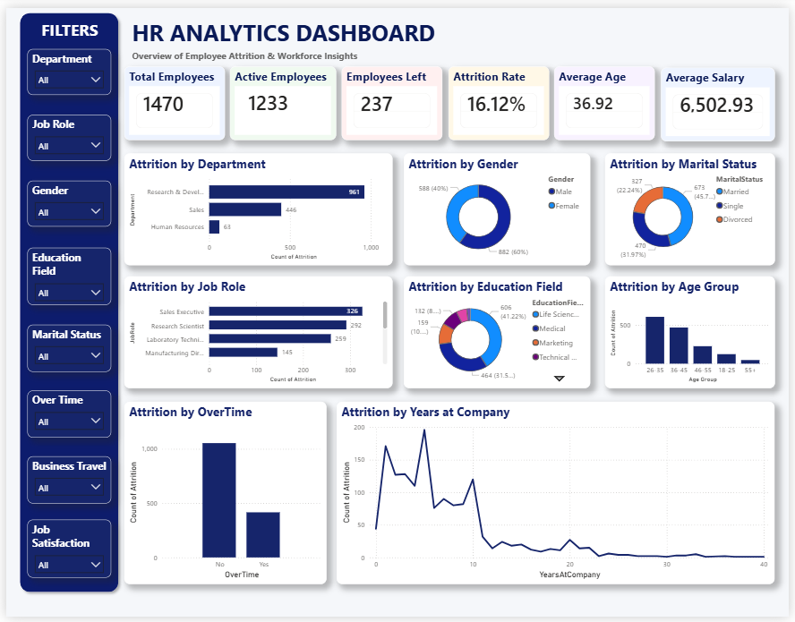
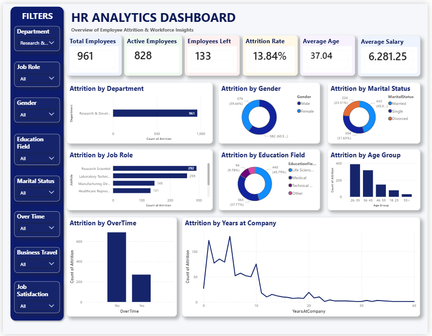
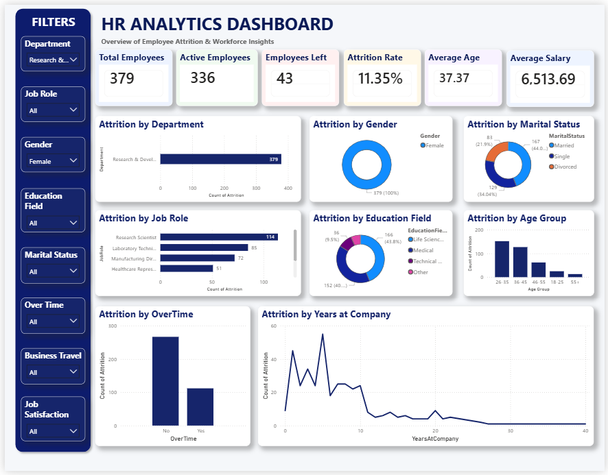
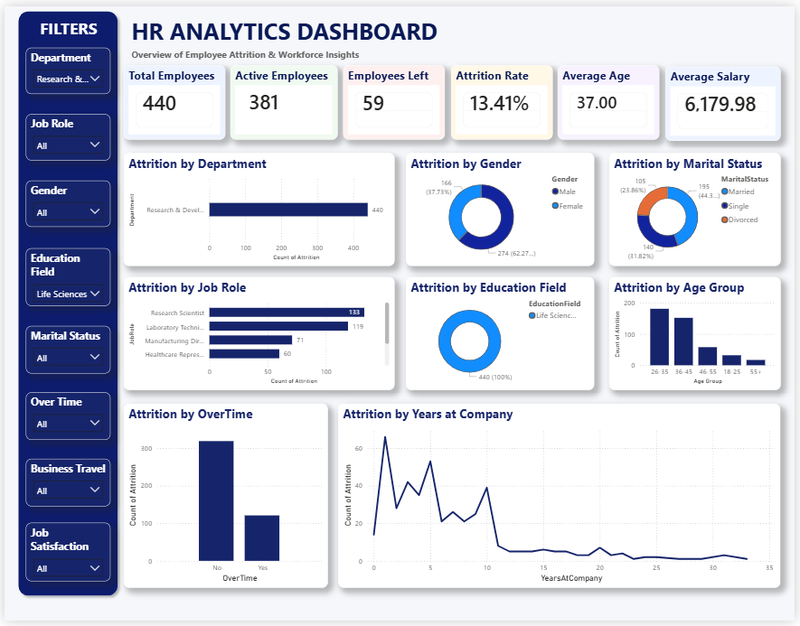
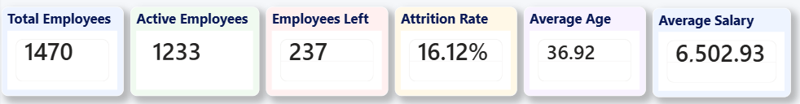

# 📊 HR Analytics Dashboard

## 🚀 Project Overview

This project presents an interactive Power BI dashboard developed to analyze employee attrition, workforce demographics, and organizational trends. The dashboard helps HR professionals identify key factors affecting employee retention and make data-driven workforce decisions.

Using the IBM HR Analytics Employee Attrition dataset, the dashboard provides comprehensive insights through KPI cards, interactive filters, and visual analytics.

---

## 📌 Dashboard Preview



---

## 🎯 Business Objectives

* Analyze employee attrition trends
* Identify departments with high employee turnover
* Understand workforce demographics
* Evaluate the impact of overtime on attrition
* Analyze attrition by job role and education field
* Build an interactive HR analytics solution

---

## 📊 Dashboard Components

### KPI Metrics

* Total Employees
* Active Employees
* Employees Left
* Attrition Rate
* Average Age
* Average Salary

### Interactive Filters

* Department
* Job Role
* Gender
* Education Field
* Marital Status
* OverTime
* Business Travel
* Job Satisfaction

### Visualizations

* Attrition by Department
* Attrition by Gender
* Attrition by Marital Status
* Attrition by Job Role
* Attrition by Education Field
* Attrition by Age Group
* Attrition by OverTime
* Attrition by Years at Company

---

## 📈 Key Insights

📍 Research & Development is the largest department in the organization.

📉 The overall employee attrition rate is 16.12%.

👥 Employees aged 26–35 contribute the highest share of attrition.

⏰ Employees working overtime are more likely to leave the company.

🎓 Life Sciences is the most common education background among employees.

💼 Sales and Research & Development departments contribute significantly to employee turnover.

---

## 🛠 Tools & Technologies

| Tool        | Purpose                        |
| ----------- | ------------------------------ |
| Power BI    | Dashboard Development          |
| Power Query | Data Cleaning & Transformation |
| DAX         | KPI Calculations               |
| CSV Dataset | Data Source                    |
| GitHub      | Version Control                |

---

## 📂 Dataset Information

### Dataset Name

IBM HR Analytics Employee Attrition & Performance Dataset

### Features

* Employee Number
* Age
* Gender
* Department
* Job Role
* Education Field
* Marital Status
* Monthly Income
* OverTime
* Years At Company
* Job Satisfaction
* Attrition

### Dataset Size

* 1,470 Employee Records
* 35+ Attributes

---

## 🔧 Data Preparation

### Data Cleaning

* Checked for missing values
* Removed unnecessary columns
* Validated categorical data
* Standardized data formats

### Feature Engineering

Created custom fields and measures:

* Active Employees
* Employees Left
* Attrition Rate
* Average Salary
* Age Groups

---

## 📊 DAX Measures

### Total Employees

```DAX
Total Employees =
COUNT(Employee[EmployeeNumber])
```

### Employees Left

```DAX
Employees Left =
CALCULATE(
COUNT(Employee[EmployeeNumber]),
Employee[Attrition] = "Yes"
)
```

### Active Employees

```DAX
Active Employees =
[Total Employees] - [Employees Left]
```

### Attrition Rate

```DAX
Attrition Rate =
DIVIDE([Employees Left],[Total Employees],0)
```

### Average Age

```DAX
Average Age =
AVERAGE(Employee[Age])
```

### Average Salary

```DAX
Average Salary =
AVERAGE(Employee[MonthlyIncome])
```

---

## 📸 Dashboard Screenshots

### Dashboard Overview


### Department Analysis



### Gender Analysis



### Education Field Analysis



### KPI Summary



---

## 🎓 Skills Demonstrated

* Data Cleaning
* Data Transformation
* Power Query
* DAX
* Data Modeling
* Data Visualization
* Dashboard Design
* Business Intelligence
* HR Analytics

---

## 📁 Project Structure

```text
HR-Analytics-Dashboard-PowerBI
│
├── Dashboard
│   └── HR_Analytics_Dashboard.pbix
│
├── Dataset
│   └── WA_Fn-UseC_-HR-Employee-Attrition.csv
│
├── Images
│   ├── 01_Dashboard_Overview.png
│   ├── 02_Department_Analysis.png
│   ├── 03_Gender_Analysis.png
│   ├── 04_Education_Field_Analysis.png
│   └── 05_KPI_Summary.png
│
└── README.md
```

---

## 👨‍💻 Author

### Shiv Gandhi

MSc Computer Science & Information Technology

Aspiring Data Analyst

### Connect With Me

LinkedIn:
linkedin.com/in/shivgandhi3002

GitHub:
github.com/gshiv23

---

⭐ If you found this project useful, please consider giving it a star.
